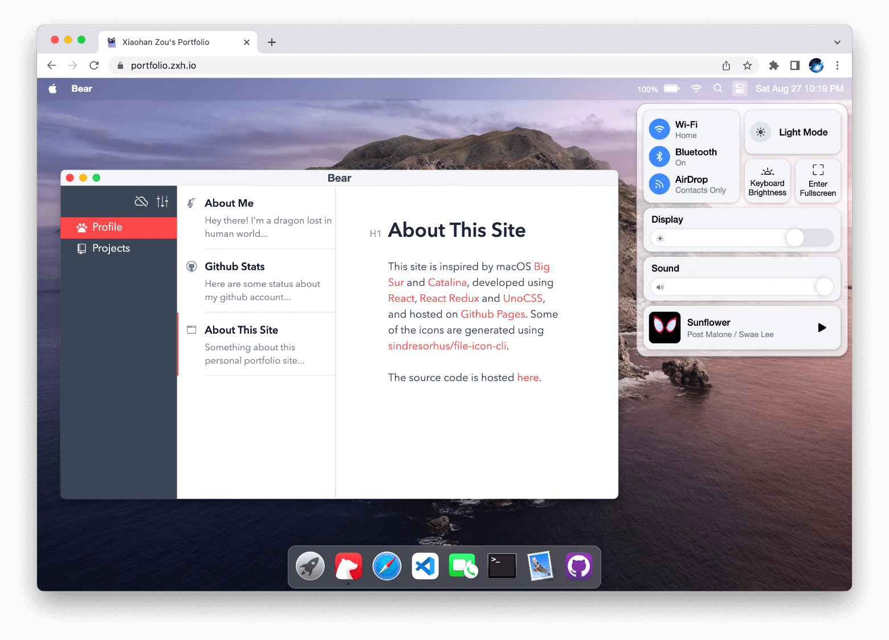
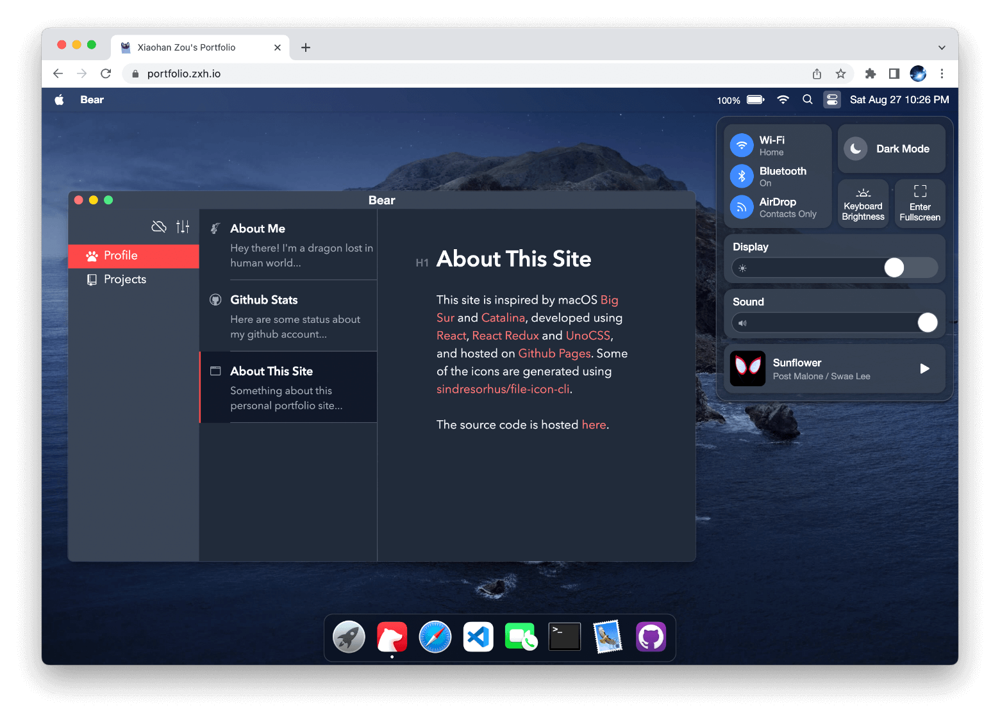

# 🨠Personal Portfolio — macOS Simulation

This is **my personal portfolio**, designed to simulate the look and feel of macOS, built using modern web technologies like **React**, **Zustand**, **UnoCSS**, **Vite**, and **TypeScript**.

> ğŸ–¥ï¸ Live Demo: [portfolio.zxh.me](https://portfolio.zxh.me) *(customize with your domain)*

The design and foundational structure are heavily inspired by the amazing work of [Renovamen](https://github.com/Renovamen), whose open-source project [playground-macos](https://github.com/Renovamen/playground-macos) served as the original base.

I’ve modified and extended the project to better represent my own personal branding and showcase my skills and projects.

---

## 🔧 Tech Stack

- [React](https://reactjs.org/)
- [Zustand](https://zustand-demo.pmnd.rs/)
- [UnoCSS](https://uno.antfu.me/)
- [Vite](https://vitejs.dev/)
- [TypeScript](https://www.typescriptlang.org/)

---

## ğŸ–¼ï¸ Screenshots

Light Mode


Dark Mode


---

## 🚀 Getting Started

Clone the repo and install dependencies:

```bash
pnpm install
Start the development server:

bash
Copy
Edit
pnpm dev
Build for production:

bash
Copy
Edit
pnpm build
📜 Changelog Highlights
Original updates from the playground-macos project:

2023.06.26: Improved FaceTime functionality.

2023.06.25: Added Typora using Milkdown.

2021.12.05: Used the Battery API for simulated charge levels.

2021.12.05: Refactored to use functional components and hooks.

🙠Credits
Huge thanks to the original creator of this project:

Renovamen – for the base UI/UX design and component structure of playground-macos.

Additional inspiration and resources from:

Apple macOS Monterey & Catalina

macOS Icon Gallery

sindresorhus/file-icon-cli

vivek9patel.github.io

📄 License
This project is licensed under the MIT License.

yaml
Copy
Edit

---

Let me know if you'd like to include your own **custom domain**, **social links**, or **project showcase sections** — I can help you tailor this even further.


You said:
Can you give all of those in 1 makrdown file?


ChatGPT said:
Absolutely! Here's the full markdown content bundled into one file, ready to be saved as README.md:

markdown
Copy
Edit
# 🨠Personal Portfolio — macOS Simulation

This is **my personal portfolio**, designed to simulate the look and feel of macOS, built using modern web technologies like **React**, **Zustand**, **UnoCSS**, **Vite**, and **TypeScript**.

> ğŸ–¥ï¸ Live Demo: [portfolio.zxh.me](https://portfolio.zxh.me) *(customize with your domain)*

The design and foundational structure are heavily inspired by the amazing work of [Renovamen](https://github.com/Renovamen), whose open-source project [playground-macos](https://github.com/Renovamen/playground-macos) served as the original base.

I’ve modified and extended the project to better represent my own personal branding and showcase my skills and projects.

---

## 🔧 Tech Stack

- [React](https://reactjs.org/)
- [Zustand](https://zustand-demo.pmnd.rs/)
- [UnoCSS](https://uno.antfu.me/)
- [Vite](https://vitejs.dev/)
- [TypeScript](https://www.typescriptlang.org/)

---

## ğŸ–¼ï¸ Screenshots

Light Mode


Dark Mode


---

## 🚀 Getting Started

Clone the repo and install dependencies:
```bash
pnpm install
```
Start the development server:
```bash
pnpm dev
```
Build for production:
```bash
pnpm build
```
📜 Changelog Highlights
Original updates from the [playground-macos](https://github.com/Renovamen/playground-macos) project:
- 2023.06.26: Improved FaceTime functionality.
- 2023.06.25: Added Typora using Milkdown.
- 2021.12.05: Used the Battery API for simulated charge levels.
- 2021.12.05: Refactored to use functional components and hooks.

🙠Credits
Huge thanks to the original creator of this project:
(Renovamen)[https://github.com/Renovamen] – for the base UI/UX design and component structure of playground-macos.
Additional inspiration and resources from:
Apple macOS (Monterey)[https://www.apple.com/macos/macos-sequoia/] & (Catalina)[https://www.apple.com/bw/mac/]
(macOS Icon Gallery)[https://www.macosicongallery.com/]
(sindresorhus/file-icon-cli)[https://github.com/sindresorhus/file-icon-cli]
(vivek9patel.github.io)[https://github.com/vivek9patel/vivek9patel.github.io]

📄 License
This project is licensed under the MIT License.